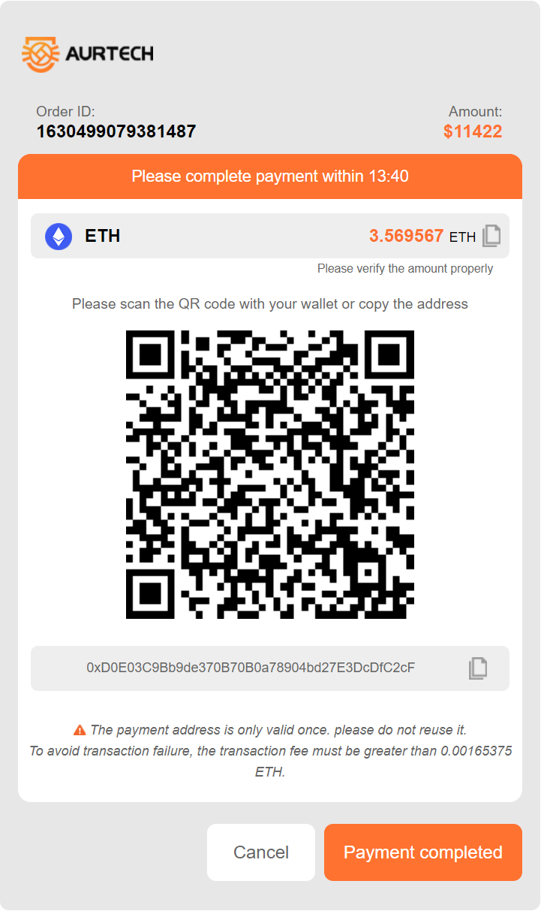

# Payment API document

#### Essential information:

		Request address：https://pay.aur-tech.com/

		Request method：get

#### Request parameters（json）：

		Parameter name		 Is it necessary					 Type					Describe						 	Participation signature

		merchantNumber 				true					   String			  	 Merchant number								yes

		orderNumber					true					   String				   Merchant order number						   yes

		currency					true 					  String 				  currency										yes

		orderAmount				  true					   String				   Number of coins charged						 yes

		sign						   true					   String				   sign								   	 	 no

		orderRemark					false					   String				   Order notes					      			no

		notifyUrl					  false					   String				   Callback address: receive payment results		no

		payment					    false					   String				   Payment method 1. Address 2. QR code			 no
		
#### Parameter description：
		merchantNumber、publicKey（Get from mailbox）
##### orderNumber
		Order number generated by the merchant
##### currency
		Currency enabled：ETH、USDT、TRX、BTC、DAI
##### orderAmount
		Number of coins charged
##### sign
		Composition: it is arranged according to the fixed order of demo. The & symbol is used to connect the parameters. After RSA encryption by merchant's private key, Base64 is used to encode
		JAVA-demo
			String signString = "currency=DAI&merchantNumber=1625046473719&orderAmount=50&orderNumber=order009"
		VUE-demo
			import {JSEncrypt} form 'jsencrypt'
			let encrypt = new JSEncrypt()
			let singString = 'currency=DAI&merchantNumber=1625046473719&orderAmount=50&orderNumber=order009'
			encrypt.setPublicKey(this.PUBLIC_KEY)
			let sign = encrypt.encrypt(this.signString)
#### Request example：
		https://pay.aur-tech.com/?merchantNumber=123456&orderNumber=order123&currency=ETH&orderAmount=0.14&sig=jldjslkfjkfjsdlskd
#### Successful examples：

