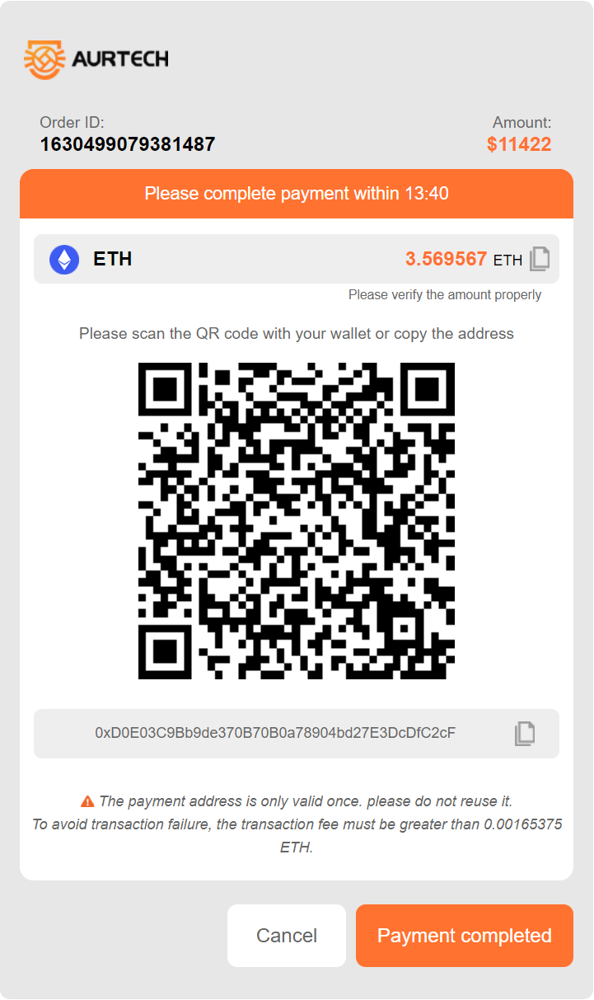

# Payment API document

## Essential information

Request address：<https://pay.aur-tech.com/>

Request method：Get

## Request parameters（json）

 | Parameter name | Required | Type   | Participation signature | Describe                                   |
 | -------------- | -------- | ------ | ----------------------- | ------------------------------------------ |
 | merchantNumber | true     | String | Y                       | Merchant number                            |
 | orderNumber    | true     | String | Y                       | Order number generated by the merchant     |
 | currency       | true     | String | Y                       | Currency enabled：ETH、USDT、TRX、BTC、DAI |
 | orderAmount    | true     | String | Y                       | Number of coins charged                    |
 | sign           | true     | String | N                       | sign                                       |
 | orderRemark    | false    | String | N                       | Order notes                                |
 | notifyUrl      | false    | String | N                       | Callback address: receive payment results  |
 | payment        | false    | String | N                       | Payment method 1. Address 2. QR code       |

## sign

Composition: it is arranged according to the fixed order of demo. The `&` symbol is used to connect the parameters. After RSA encryption by merchant's `public key`,  `Base64` is used to encode.

### JAVA

`String signString = "currency=DAI&merchantNumber=1625046473719&orderAmount=50&orderNumber=order009"`

### VUE

``` Javascript

import {JSEncrypt} form 'jsencrypt'
let encrypt = new JSEncrypt()
let singString = 'currency=DAI&merchantNumber=1625046473719&orderAmount=50&orderNumber=order009'
encrypt.setPublicKey(this.PUBLIC_KEY)
let sign = encrypt.encrypt(this.signString)

```

## Request example

  ` https://pay.aur-tech.com/?merchantNumber=123456&orderNumber=order123&currency=ETH&orderAmount=0.14&sig=jldjslkfjkfjsdlskd `

## Successful examples


