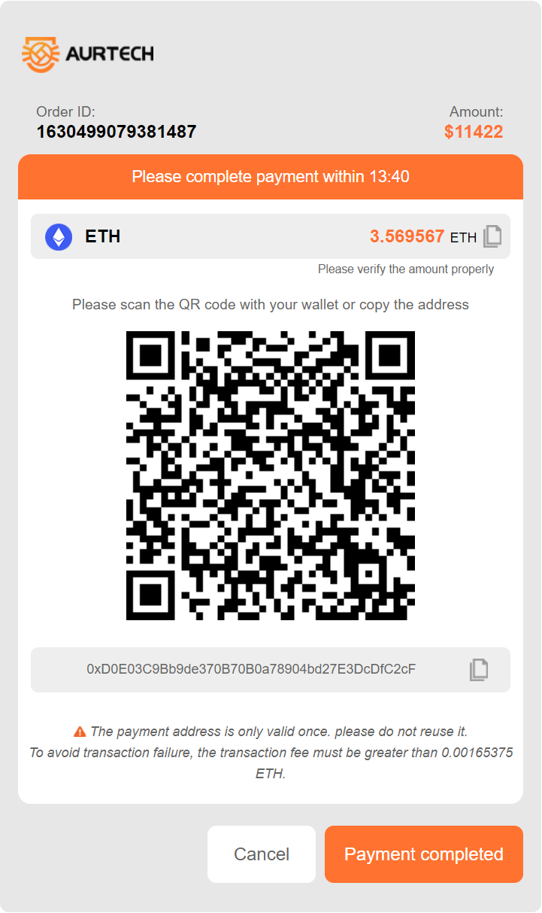

# 支付 API 文档

## 必要信息

请求地址：<https://pay.aur-tech.com/>

请求方法：Get

## 请求参数（json）

 | 参数名         | 是否必需 | 类型   | 参与签名 | 描述                                       |
 | -------------- | -------- | ------ | -------- | ------------------------------------------ |
 | merchantNumber | true     | String | Y        | Merchant number                            |
 | orderNumber    | true     | String | Y        | Order number generated by the merchant     |
 | currency       | true     | String | Y        | Currency enabled：ETH、USDT、TRX、BTC、DAI |
 | orderAmount    | true     | String | Y        | Number of coins charged                    |
 | sign           | true     | String | N        | sign                                       |
 | orderRemark    | false    | String | N        | Order notes                                |
 | notifyUrl      | false    | String | N        | Callback address: receive payment results  |
 | payment        | false    | String | N        | Payment method 1. Address 2. QR code       |

## sign 签名说明

根据 demo 中的固定顺序排列各参数，以 `&` 连接各个参数，在通过商户 ID（`public key`） 加密后，再通过 `Base64` 编码，即完成参数签名。

### JAVA

`String signString = "currency=DAI&merchantNumber=1625046473719&orderAmount=50&orderNumber=order009"`

### VUE

``` Javascript

import {JSEncrypt} form 'jsencrypt'
let encrypt = new JSEncrypt()
let singString = 'currency=DAI&merchantNumber=1625046473719&orderAmount=50&orderNumber=order009'
encrypt.setPublicKey(this.PUBLIC_KEY)
let sign = encrypt.encrypt(this.signString)

```

## 请求示例

  ` https://pay.aur-tech.com/?merchantNumber=123456&orderNumber=order123&currency=ETH&orderAmount=0.14&sig=jldjslkfjkfjsdlskd `

## 成功示例


